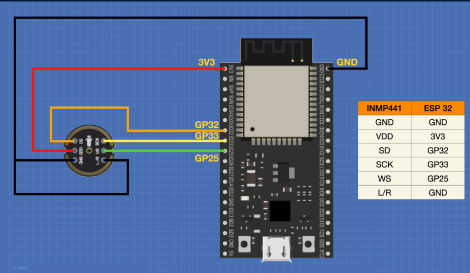

# 🎙️ ESP32 Work Assistant

Voice-controlled work assistant running entirely on ESP32 with neural networks.

## What it does

- Uses short-time fast fourier transform and machine learning to recognizes voice command for waking up the system
- Uses custom neural network trained on ~2GB of voice data, trained to recognize the word "Marvin"
- Future: After waking up, process audio and send voice commands to clound for identification and execution (Now only replays the sound)

## Hardware needed and wiring

- ESP32 DevKit V1 (160MHz, 520KB RAM)
- INMP441 MEMS microphone (I2S, 24-bit)

## How it works

1. **Audio capture** → INMP441 records 24-bit audio
2. **Signal processing** → STFT converts to spectrogram
3. **Neural network** → 10-layer CNN recognizes wake-up word
4. **Action** → Execute work assistant commands (now only plays sound back)

## STFT Configuration

- Window size: 256 samples (16ms at 16kHz)
- Window type: Hann window
- Overlap: 50% (128 samples)
- FFT size: 64 points
- Output: 64×32 spectrogram frames for neural network

## Performance

- **Recognition accuracy:** 95%+
- **Response time:** <150ms
- **Memory usage:** <400KB RAM
- **Power:** ~80mA @ 3.3V

## Libraries used

- ESP-IDF v5.1.2
- ESP-DSP v1.4.10 (signal processing)
- ESP-NN v1.0.2 (neural network acceleration)
- TensorFlow Lite Micro v1.2.0

## Project info
**Academic project** demonstrating embedded AI and real-time signal processing
